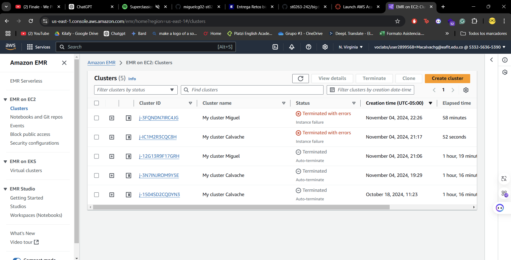
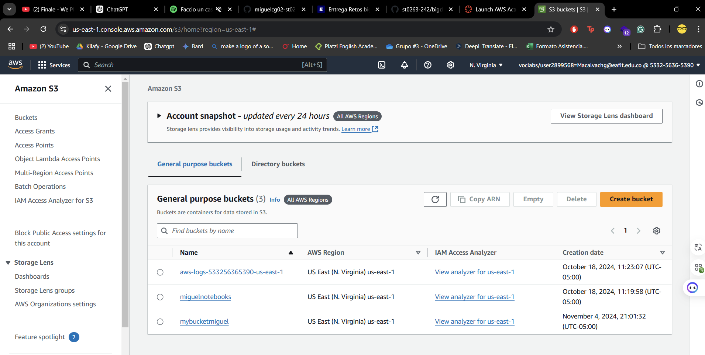

# Lab 0

**Curso:** ST0263 - Tópicos Especiales en Telemática
 **Profesor:** Edwin Montoya - emontoya@eafit.edu.co
 **Estudiantes:**
- Miguel Ángel Calvache Giraldo
  
 **Título:** Laboratorio 0 - EMR

Se siguió la guia anexada en el repositiorio.

## Evidencias

