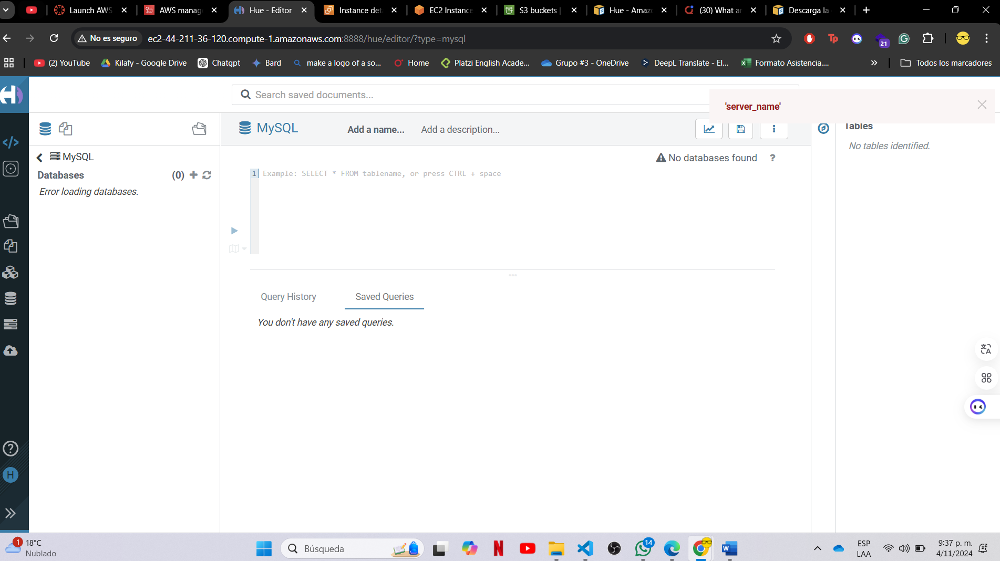
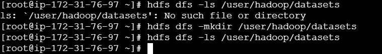
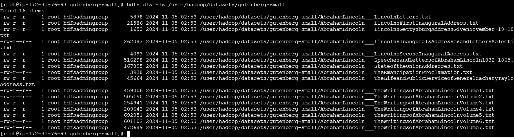
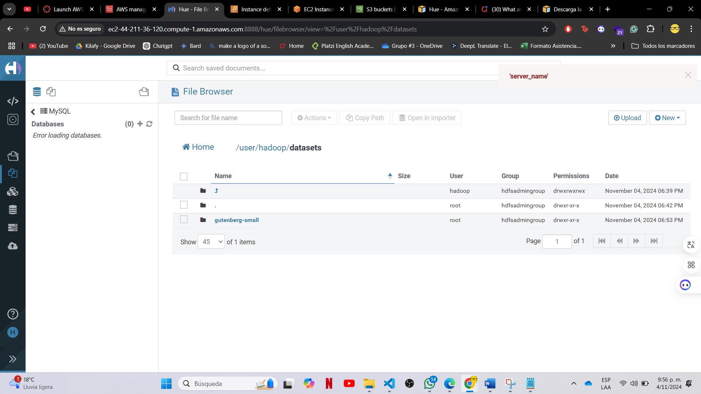
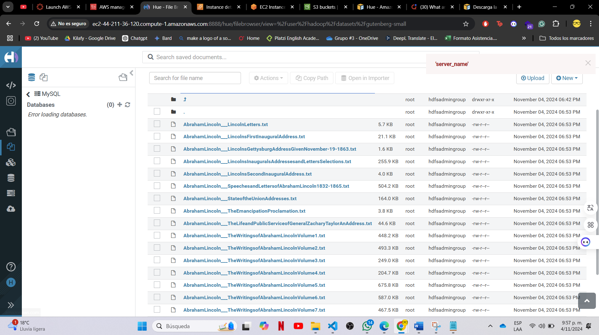
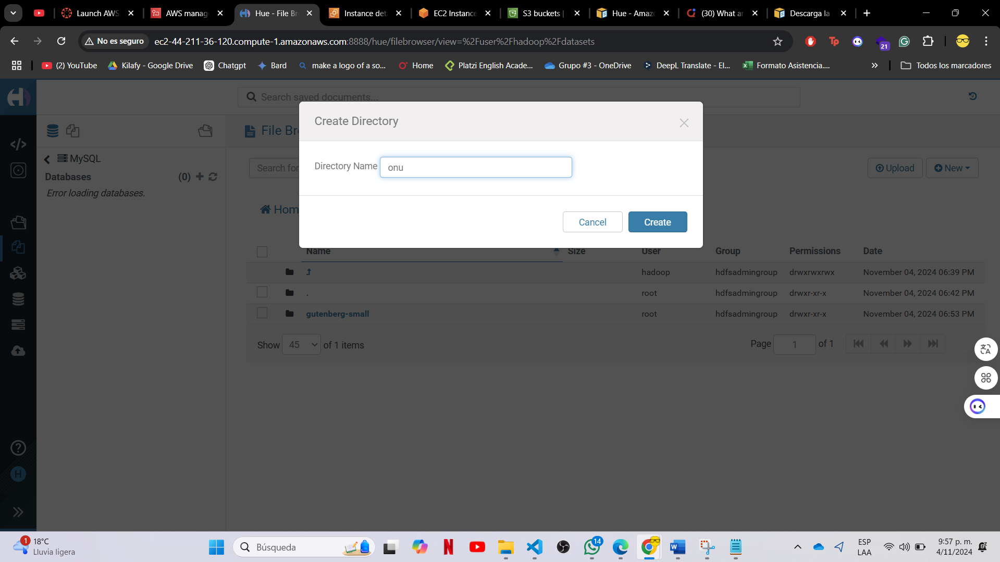
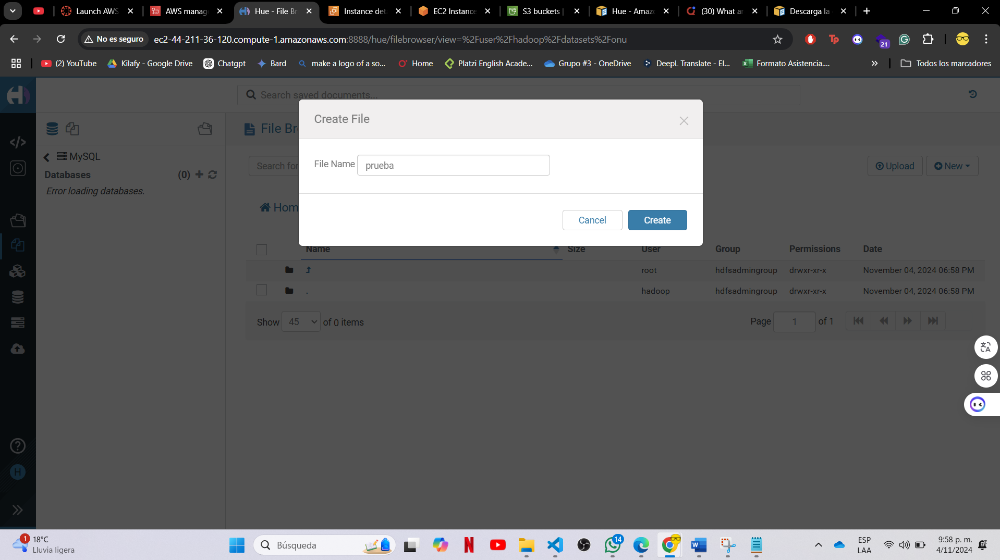
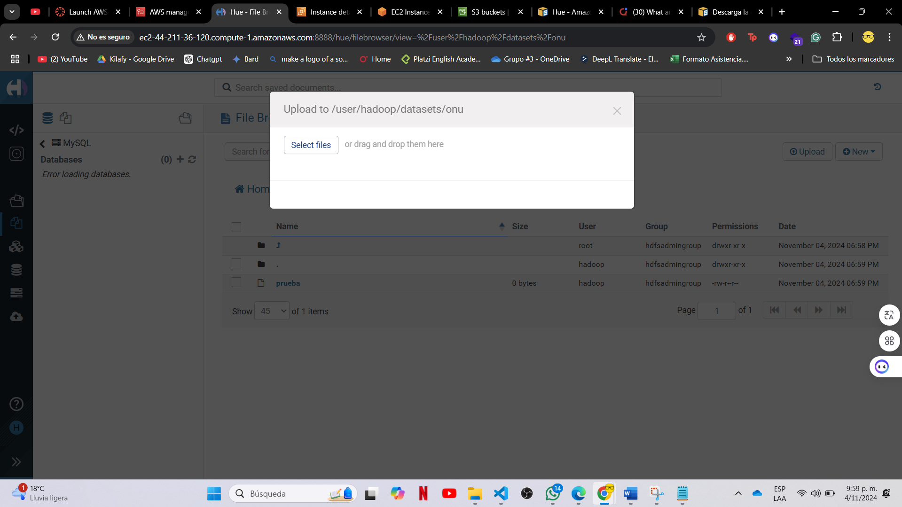
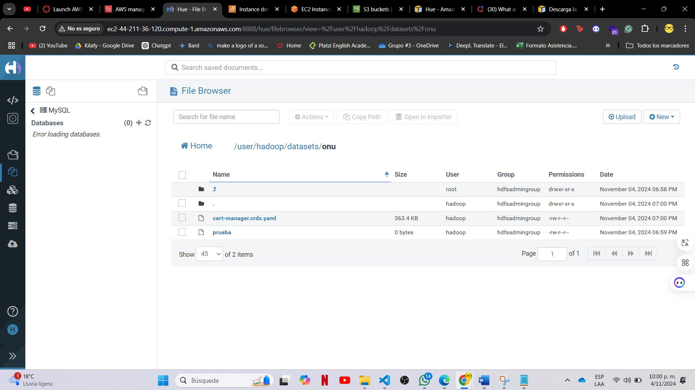
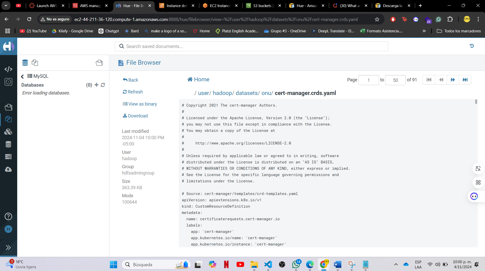

# Proyecto 1

**Curso:** ST0263 - Tópicos Especiales en Telemática
 **Profesor:** Edwin Montoya - emontoya@eafit.edu.co
 **Estudiantes:**
- Miguel Ángel Calvache Giraldo
  
 **Título:** Laboratorio 1 - HDFS

## Evidencias

Se puede acceder al hue de hadoop en la siguiente dirección: http://ec2-44-211-36-120.compute-1.amazonaws.com:8888/

Luego por consola desde nodo master se crea el directorio de datsets

se crea el directorio para gutenberg-small, se copia el archivo y se verifica que se haya copiado correctamente

se revisa desde el hue de hadoop que se haya copiado correctamente

Luego probamos desde la web la creación de directorios y archivos

