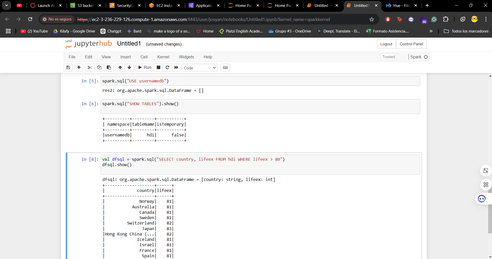

# Lab 2

**Curso:** ST0263 - Tópicos Especiales en Telemática
<br>**Profesor:** Edwin Montoya - emontoya@eafit.edu.co
<br>**Estudiantes:**
- Miguel Ángel Calvache Giraldo
  
<br>**Título:** Laboratorio 1 - HDFS

## Evidencias

1. crear un EMR en AWS con hue

2. Manualmente se añadieron los directorios y archivos que iban a ser utilizados en el laboratorio


3. Ingresar a la consola del nodo master EC2

4. Iniciar beeline desde la consola del nodo master

```
beeline -u 'jdbc:hive2://localhost:10000' -n hadoop
```
Nota: cambiar por su hive

5. Crear la base de datos

```
CREATE DATABASE IF NOT EXISTS usernamedb;
```

6. seleccionar bdd y crear tabla

```
use usernamedb;
CREATE TABLE HDI (id INT, country STRING, hdi FLOAT, lifeex INT, mysch INT, eysch INT, gni INT) ROW FORMAT DELIMITED FIELDS TERMINATED BY ','STORED AS TEXTFILE;
```


7. Cargar datos en la tabla

```
$ hdfs dfs -put hdfs:///user/hadoop/datasets/onu/hdi-data.csv hdfs:///user/hive/warehouse/usernamedb.db/hdi
```

8. Verificar que se haya copiado correctamente

```
describe hdi;
select * from hdi;
```


9. Realizar operaciones con la tabla

```
select country, gni from hdi where gni > 2000;   
```


10. Conectarse a jupyter con la url entregada por el EMR

11. Crear un nuevo notebook spark

12. Conectarse a la tabla y realizar operaciones:

