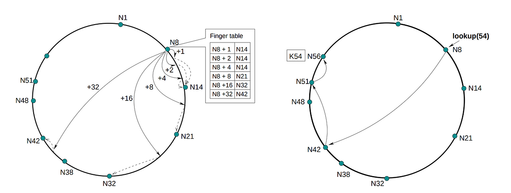

# ST0263 Tópicos Especiales en Telemática, 2024-2

# Estudiante(s): 
Miguel Angel Calvache Giraldo - macalvachg@eafit.edu.co
Miguel Angel Martinez Garcia - mamartin11@eafit.edu.co

# Profesor:

Edwin Nelson Montoya - emontoya@eafit.brightspace.com

# Arquitectura P2P y Comunicación entre procesos mediante API REST, RPC y MOM

# 1. breve descripción de la actividad

Diseñar e implementar un sistema P2P descentralizado y distribuido basado en la arquitectura DHT/Chord tipo anillo. Cada nodo (peer) del sistema debe soportar un conjunto de microservicios que faciliten la compartición de archivos.

### Requisitos del Sistema:

* Estructura de Red: La red P2P es estructurada, utilizando DHT/Chord. 
* Nodos/Peers: Cada nodo incluye un módulo servidor (PServidor) y un módulo cliente (PCliente). El servidor debe soportar concurrencia para permitir múltiples conexiones simultáneas.
* Acceso al Servicio: Todos los peer entran por un peer de arranque (bootstrap peer) para unirse a la red.
* Mantenimiento de la Red y Localización de Recursos: El sistema debe gestionar la red P2P y localizar recursos, pero no realizará transferencias de archivos reales. Sin embargo, implementarservicios ECO o dummies para simular la descarga y carga de archivos.
* Comunicación entre Procesos: Se utiliza middleware como API REST, gRPC y MOM para implementar la comunicación RPC.
* Recursos Compartidos: Cada peer compartirá un índice de archivos disponibles en un directorio configurable durante el inicio del microservicio.
* Archivo de Configuración: Cada peer tiene un archivo de configuración que definirá parámetros como la IP, puerto de escucha, directorio de archivos, y la URL de un peer de bootstrap inicial.

## 1.2. Que aspectos NO cumplió o desarrolló de la actividad propuesta por el profesor (requerimientos funcionales y no funcionales)

# 2. información general de diseño de alto nivel, arquitectura, patrones, mejores prácticas utilizadas.

# 3. Descripción del ambiente de desarrollo y técnico: lenguaje de programación, librerias, paquetes, etc, con sus numeros de versiones.

``docker run -d --hostname my-rabbit --name some-rabbit -p 5672:5672 -p 15672:15672 rabbitmq:3-management
``

## Compilación y ejecución.

## Detalles del desarrollo.

## Detalles técnicos

## Descripción y como se configura los parámetros del proyecto (ej: ip, puertos, conexión a bases de datos, variables de ambiente, parámetros, etc)

## Opcional - detalles de la organización del código por carpetas o descripción de algún archivo. (ESTRUCTURA DE DIRECTORIOS Y ARCHIVOS IMPORTANTE DEL PROYECTO, comando 'tree' de linux)

# 4. Descripción del ambiente de EJECUCIÓN (en producción) lenguaje de programación, librerias, paquetes, etc, con sus numeros de versiones.

# IP o nombres de dominio en nube o en la máquina servidor.

## descripción y como se configura los parámetros del proyecto (ej: ip, puertos, conexión a bases de datos, variables de ambiente, parámetros, etc)

## como se lanza el servidor.

## Una mini guia de como un usuario utilizaría el software o la aplicación

# 5. otra información que considere relevante para esta actividad.

# referencias:

## sitio1-url 
## sitio2-url
## url de donde tomo info para desarrollar este proyecto