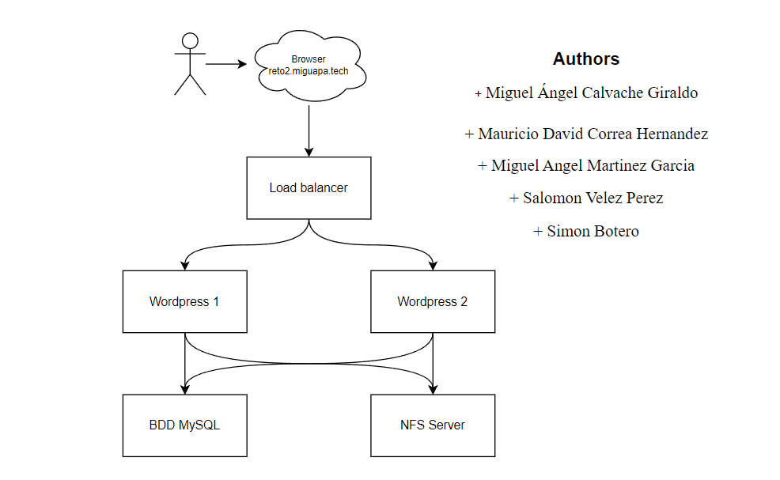

# Reto 2

**Curso:** ST0263 - Tópicos Especiales en Telemática
 **Profesor:** Edwin Montoya - emontoya@eafit.edu.co
 **Estudiantes:**
- Miguel Ángel Calvache Giraldo
- Mauricio David Correa Hernandez
- Miguel Angel Martinez Garcia
- Salomon Velez Perez
- Simon Botero
  
 **Título:** Aplicación Monolítica con Balanceo y Datos Distribuidos (BD y archivos)
 **Objetivo:** Implementar un CMS empleando la tecnología de contenedores, con su propio dominio y certificado SSL.  **Sustentación:** 
https://youtu.be/b-RwPSz6Chw

## 1. Descripción de la actividad
#### 1.1. Aspectos cumplidos:

- Crear nuestro propio dominio (miguapamundi.tech) con su configuración TXT.
- Wordpress dckerizado.
- Certificado SSL con Let's Encrypt.
- Balanceador de cargas con Ngnix y Docker.
- Dos instancias de Wordpress.
- Una base de datos MySQL.
- Un NFS Server para los archivos.

#### 1.2. Aspectos no desarrollados:

Se cumplió con todo lo especificado para este reto.

## 2. Arquitectura del sistema

A continuación se observa el diagrama de la arquitectura usada para nuestro proyecto.

