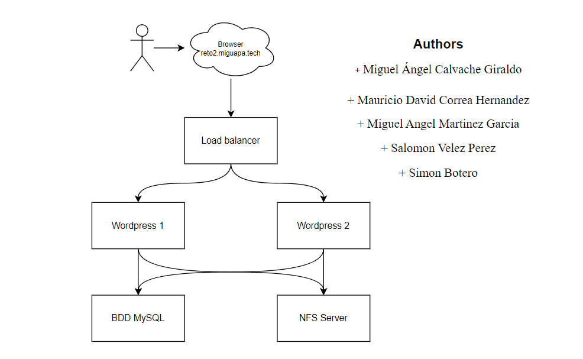

# Reto 2-1: Aplicación Monolítica con Balanceo y Datos Distribuidos (BD y archivos)

**Curso:** ST0263 - Tópicos Especiales en Telemática
<br>**Profesor:** Edwin Montoya - emontoya@eafit.edu.co
<br>**Estudiantes:**
- Miguel Ángel Calvache Giraldo
- Mauricio David Correa Hernandez
- Miguel Angel Martinez Garcia
- Salomon Velez Perez
- Simon Botero
  
<br>**Título:** Aplicación Monolítica con Balanceo y Datos Distribuidos (BD y archivos)
<br>**Objetivo:** Implementar un CMS empleando la tecnología de contenedores, con su propio dominio y certificado SSL. <br>**Sustentación:** 
https://youtu.be/b-RwPSz6Chw

## 1. Descripción de la actividad
#### 1.1. Aspectos cumplidos:

- Crear nuestro propio dominio (miguapa.tech) con su configuración TXT.
- Wordpress dckerizado.
- Certificado SSL con Let's Encrypt.
- Balanceador de cargas con Ngnix y Docker.
- Dos instancias de Wordpress.
- Una base de datos MySQL.
- Un NFS Server para los archivos.

#### 1.2. Aspectos no desarrollados:

Se cumplió con todo lo especificado para este reto.

## 2. Arquitectura del sistema

A continuación se observa el diagrama de la arquitectura usada para nuestro proyecto.

      

## 3. Descripción del ambiente de desarrollo

Para este proyecto, se implementaron varios servicios, cada uno en una instancia EC2 de Amazon Web Services. Cada instancia utiliza una imagen de Ubuntu 22.04 LTS y corresponde al tipo t2.micro.

### 3.1 Configuración NFS

Crear una MV EC2 t2.micro, Ubuntu

```
sudo apt update
sudo apt install nfs-kernel-server -y
```

Crear el directorio a compartir entre clientes

```
sudo mkdir /var/nfs/toShare1 -p
```

Configurar permisos de acceso

```
sudo chown nobody:nogroup /var/nfs/toShare1
sudo chmod 777 /var/nfs/toShare1
```

Configurar los exports

```
sudo nano /etc/exports
```

Agregar la siguiente línea

```
/var/nfs/toShare1 *(rw,sync,no_subtree_check)
```

Reiniciar el servicio

```
sudo systemctl restart nfs-kernel-server
```

Habilitar el firewall

```
sudo ufw enable
sudo ufw allow from
```

## 3.2 Configruación BDD MySQL

Crear una MV EC2 t2.micro, Ubuntu

```
sudo apt-get update
sudo apt install docker.io -y
sudo apt install docker-compose -y
```

Crear el archivo docker-compose.yml

```
sudo nano docker-compose.yml
```

```
version: '3.1'
services:
  db:
    image: mysql:5.7
    restart: always
    ports:
      - 3306:3306
    environment:
      MYSQL_DATABASE: exampledb
      MYSQL_USER: exampleuser
      MYSQL_PASSWORD: examplepass
      MYSQL_RANDOM_ROOT_PASSWORD: '1'
    volumes:
      - db:/var/lib/mysql
volumes:
  db:
```

Ejecutar el contenedor automaticamente

```
sudo systemctl enable docker
sudo systemctl start docker
sudo usermod -a -G docker ubuntu
```

Constuir el contenedor

```
sudo docker-compose up --build -d
```

## 3.3 Configuración Wordpress

Crear una MV EC2 t2.micro, Ubuntu

```
sudo apt-get update
sudo apt install docker.io -y
sudo apt install docker-compose -y
```

Crear el archivo docker-compose.yml

```
sudo nano docker-compose.yml
```

OJO: Cambiar la ip por la ip de la instancia de la base de datos

```
version: '3.1'
services:
  wordpress:
    container_name: wordpress
    image: wordpress
    ports:
      - 80:80
    restart: always
    environment:
      WORDPRESS_DB_HOST: [IP de la instancia de la base de datos]
      WORDPRESS_DB_USER: exampleuser
      WORDPRESS_DB_PASSWORD: examplepass
      WORDPRESS_DB_NAME: exampledb
    volumes:
      - wordpress:/var/www/html
volumes:
  wordpress:
```

Ejecutar el contenedor automaticamente

```
sudo systemctl enable docker
sudo systemctl start docker
sudo usermod -a -G docker ubuntu
```

Constuir el contenedor

```
sudo docker-compose up --build -d
```

Agregar nfs

```
sudo apt update
sudo apt install nfs-common -y
sudo mkdir /nfs/wordpress -p
sudo mount [IP de la instancia NFS]:/var/nfs/toShare1 /nfs/wordpress
```

Para verificar

```
df -h
```

## 3.4 Configuración Nginx - Balanceador de Cargas

- Configuramos nuestra máquina virtual, en este caso una instancia EC2 t2.micro con Ubuntu 22.04.
- Accedemos a la sección de IP elásticas en AWS, creamos una nueva IP y la asignamos a la instancia creada.
- Entramos al portal de nuestro proveedor de dominio y creamos un registro A para el subdominio, apuntándolo a la IP elástica que acabamos de asociar.

Instalar cerbot para certificado SSL

```
sudo apt update
sudo add-apt-repository ppa:certbot/certbot
sudo apt install letsencrypt -y
sudo apt install nginx -y
```

Crear certificado SSL

OJO: Cambiar nuestrodominio.com por el dominio que se haya creado
```
sudo mkdir -p /var/www/letsencrypt
sudo certbot --server https://acme-v02.api.letsencrypt.org/directory -d *.nuestrodominio.com --manual --preferred-challenges dns-01 certonly
```

Nota: El registro TXT generado por certbot se debe agregar en el proveedor de dominio

Docker

```
sudo apt update
sudo apt install docker.io -y
sudo apt install docker-compose -y
sudo apt install git -y
sudo systemctl enable docker
sudo systemctl start docker
sudo usermod -aG docker ubuntu
```

Crear directorio del balanceador

```
mkdir loadbalancer
mkdir loadbalancer/ssl
```

Copair certificaod creado

```
sudo su
cp /etc/letsencrypt/live/nuestrodominio.com/* /home/ubuntu/loadbalancer/ssl
```

Crear archivo de configuración

```
nano loadbalancer/nginx.conf
```

OJO: Cambiar wordpress_ip1 y wordpress_ip2 por las ip (priv) de las instancias de wordpress

```nginx
worker_processes auto;
error_log /var/log/nginx/error.log;
pid /run/nginx.pid;

events {
    worker_connections 1024;  ## Default: 1024
}

http {
    upstream backend {
        server <wordpress_ip1>;
        server <wordpress_ip2>;
    }

    server {
        listen 80;
        listen [::]:80;
        server_name _;
        rewrite ^ https://$host$request_uri permanent;
    }

    server {
        listen 443 ssl http2 default_server;
        listen [::]:443 ssl http2 default_server;
        server_name _;

        # enable subfolder method reverse proxy confs
        #include /config/nginx/proxy-confs/*.subfolder.conf;

        # all ssl related config moved to ssl.conf
        include /etc/nginx/ssl.conf;

        client_max_body_size 0;

        location / {
            proxy_pass http://backend;
            proxy_redirect off;
            proxy_set_header Host $host;
            proxy_set_header X-Real-IP $remote_addr;
            proxy_set_header X-Forwarded-For $proxy_add_x_forwarded_for;
            proxy_set_header X-Forwarded-Host $host;
            proxy_set_header X-Forwarded-Server $host;
            proxy_set_header X-Forwarded-Proto $scheme;
        }
    }
}
```

Crear archivo de configuración SSL

```
nano loadbalancer/ssl.conf
```

```
## Version 2018/05/31 - Changelog: https://github.com/linuxserver/docker-letsencrypt/commits/master/root/defaults/ssl.conf

# session settings
ssl_session_timeout 1d;
ssl_session_cache shared:SSL:50m;
ssl_session_tickets off;

# Diffie-Hellman parameter for DHE cipher suites
# ssl_dhparam /etc/nginx/ssl/ssl-dhparams.pem;

# ssl certs
ssl_certificate /etc/nginx/ssl/fullchain.pem;
ssl_certificate_key /etc/nginx/ssl/privkey.pem;

# protocols
ssl_protocols TLSv1.1 TLSv1.2;
ssl_prefer_server_ciphers on;
ssl_ciphers 'ECDHE-RSA-AES128-GCM-SHA256:ECDHE-ECDSA-AES128-GCM-SHA256:ECDHE-RSA-AES256-GCM-SHA384:ECDHE-ECDSA-AES256-GCM-SHA384:DHE-RSA-AES128-GCM-SHA256:ECDHE-RSA-AES128-SHA256:ECDHE-ECDSA-AES128-SHA256:ECDHE-RSA-AES128-SHA:ECDHE-ECDSA-AES128-SHA:ECDHE-RSA-AES256-SHA384:ECDHE-ECDSA-AES256-SHA384:ECDHE-RSA-AES256-SHA:ECDHE-ECDSA-AES256-SHA:DHE-RSA-AES128-SHA256:DHE-RSA-AES128-SHA:DHE-RSA-AES256-SHA256:DHE-RSA-AES256-SHA:!aNULL:!eNULL:!EXPORT:!DES:!RC4:!MD5:!PSK:!aECDH:!EDH-DSS-DES-CBC3-SHA:!EDH-RSA-DES-CBC3-SHA:!KRB5-DES-CBC3-SHA';

# HSTS, remove # from the line below to enable HSTS
add_header Strict-Transport-Security "max-age=63072000; includeSubDomains; preload" always;

# OCSP Stapling
ssl_stapling on;
ssl_stapling_verify on;

# Optional additional headers
#add_header Content-Security-Policy "upgrade-insecure-requests";
#add_header X-Frame-Options "SAMEORIGIN" always;
#add_header X-XSS-Protection "1; mode=block" always;
#add_header X-Content-Type-Options "nosniff" always;
#add_header X-UA-Compatible "IE=Edge" always;
#add_header Cache-Control "no-transform" always;
#add_header Referrer-Policy "same-origin" always;
```

Crear archivo de configuración docker-compose

```
version: '3.1'
services:
  nginx:
    container_name: nginx
    image: nginx
    volumes:
    - ./nginx.conf:/etc/nginx/nginx.conf:ro
    - ./ssl:/etc/nginx/ssl
    - ./ssl.conf:/etc/nginx/ssl.conf
    ports:
    - 80:80      
    - 443:443
```

Reiniciar nginx

```
ps ax | grep nginx
netstat -an | grep 80

sudo systemctl disable nginx
sudo systemctl stop nginx
exit
```

Construir el contenedor

```
cd loadbalancer
sudo docker-compose up --build -d
```

## 4. Referencias

1. https://github.com/st0263eafit/st0263-242/tree/main/docker-nginx-wordpress-ssl-letsencrypt
2. https://www.youtube.com/watch?v=zmDIfJtCKCk 