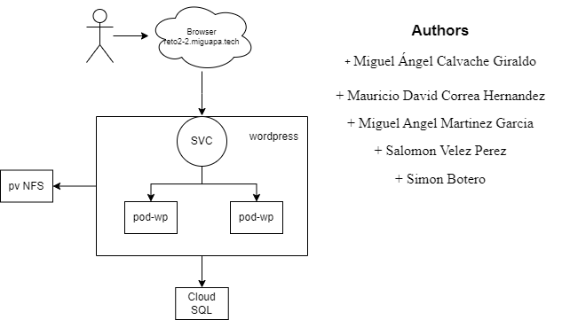

# Reto 2 

**Curso:** ST0263 - Tópicos Especiales en Telemática
<br>**Profesor:** Edwin Montoya - emontoya@eafit.edu.co
<br>**Estudiantes:**
- Miguel Ángel Calvache Giraldo
- Mauricio David Correa Hernandez
- Miguel Angel Martinez Garcia
- Salomon Velez Perez
- Simon Botero
  
<br>**Título:** Aplicación Monolítica con Balanceo y Datos Distribuidos (BD y archivos)
<br>**Objetivo:** Implementar un CMS empleando la tecnología de contenedores, con su propio dominio y certificado SSL. <br>**Sustentación:** 

## 1. Descripción de la actividad
#### 1.1. Aspectos cumplidos:

- Wordpress con Kubernetes
- Dos pods de Wordpress
- CLoud SQL con gcp para Mysql
- Un servidor NFS para los archivos de gcp
- Balanceador de cargas con Kubernetes
- Dominio propio (reto2-2.miguapamundi.tech)

#### 1.2. Aspectos no desarrollados:

- Certificado SSL

## 2. Arquitectura del sistema

A continuación se observa el diagrama de la arquitectura usada para nuestro proyecto.

      

## 3. Descripción del ambiente de desarrollo

Se siguió la guia de https://cloud.google.com/kubernetes-engine/docs/tutorials/persistent-disk?hl=es-419 para la creación de los pods, el balanceador de cargas y base de datos.


Configuración NFS

Habilitar la API de Kubernetes Engine en: 
https://console.cloud.google.com/flows/enableapi?apiid=container.googleapis.com%2Cfile.googleapis.com&hl=es-419&_ga=2.180154595.671953939.1715183695-1082497697.1714848645&_gac=1.118745723.1714961732.CjwKCAjw3NyxBhBmEiwAyofDYYHyvqIxZaEmvGafpJTSskf7rpX_rBdXg4XCTYYAMNdtWLzAnI6kYxoC1hgQAvD_BwE

Habiliatar el controlador CSI

```
gcloud container clusters update $CLUSTER_NAME \ --update-addons=GcpFilestoreCsiDriver=ENABLED
```

Dirigirse a los servicios de GCP y crear una instancia de Filestore

Cuando se cree, volver a la consola y crear el archivo yaml

```
sudo nano nfs-pv-pvc.yaml
```

OJO: Cambiar la IP de Filestore en el archivo yaml y volumeHandle del CSI a la ruta adecuada

```
apiVersion: v1
kind: PersistentVolume
metadata:
  name: nfs-pv
spec:
  storageClassName: ""
  capacity:
    storage: 1Ti
  accessModes:
    - ReadWriteMany
  persistentVolumeReclaimPolicy: Retain
  volumeMode: Filesystem
  csi:
    driver: filestore.csi.storage.gke.io
    volumeHandle: "modeInstance/us-central1-c  /nfs-reto2.2/nfs_files" # OJO CON ESTO
    volumeAttributes:
      ip: [IP_FILESTORE]
      volume: nfs_files
---
kind: PersistentVolumeClaim
apiVersion: v1
metadata:
  name: podpvc
spec:
  accessModes:
    - ReadWriteMany
  storageClassName: ""
  volumeName: nfs-pv
  resources:
    requests:
      storage: 1Ti
```

Correr el manifiesto

```
kubectl apply -f nfs-pv-pvc.yaml
```

La configuración de los otros yaml es la siguiente

wordpress_cloudsql.yaml

```
apiVersion: apps/v1
kind: Deployment
metadata:
  name: wordpress
  labels:
    app: wordpress
spec:
  replicas: 2
  selector:
    matchLabels:
      app: wordpress
  template:
    metadata:
      labels:
        app: wordpress
    spec:
      containers:
        - image: wordpress
          name: wordpress
          env:
          - name: WORDPRESS_DB_HOST
            value: 127.0.0.1:3306
          # These secrets are required to start the pod.
          - name: WORDPRESS_DB_USER
            valueFrom:
              secretKeyRef:
                name: cloudsql-db-credentials
                key: username
          - name: WORDPRESS_DB_PASSWORD
            valueFrom:
              secretKeyRef:
                name: cloudsql-db-credentials
                key: password
          ports:
            - containerPort: 80
              name: wordpress
          volumeMounts:
            - name: wordpress-persistent-storage
              mountPath: /var/www/html
        # Change ${INSTANCE_CONNECTION_NAME} here to include your GCP
        # project, the region of your Cloud SQL instance and the name
        # of your Cloud SQL instance. The format is
        # $PROJECT:$REGION:$INSTANCE
        - name: cloudsql-proxy
          image: gcr.io/cloudsql-docker/gce-proxy:1.33.2
          command: ["/cloud_sql_proxy",
                    "-instances=${INSTANCE_CONNECTION_NAME}=tcp:3306",
                    # If running on a VPC, the Cloud SQL proxy can connect via Private IP. See:
                    # https://cloud.google.com/sql/docs/mysql/private-ip for more info.
                    # "-ip_address_types=PRIVATE",
                    "-credential_file=/secrets/cloudsql/key.json"]
          securityContext:
            runAsUser: 2  # non-root user
            allowPrivilegeEscalation: false
          volumeMounts:
            - name: cloudsql-instance-credentials
              mountPath: /secrets/cloudsql
              readOnly: true
      volumes:
        - name: wordpress-persistent-storage
          persistentVolumeClaim:
            claimName: podpvc
        - name: cloudsql-instance-credentials
          secret:
            secretName: cloudsql-instance-credentials
```

wordpress-service.yaml

```
apiVersion: v1
kind: Service
metadata:
  labels:
    app: wordpress
  name: wordpress
spec:
  type: LoadBalancer
  ports:
    - port: 80
      targetPort: 80
      protocol: TCP
      name: http
    - port: 443
      targetPort: 443
      protocol: TCP
      name: https
  selector:
    app: wordpress
```
